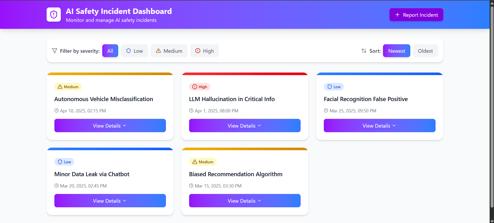

# AI Safety Incident Dashboard

 

A responsive web dashboard for tracking and managing AI safety incidents. This application allows users to report, filter, sort, and view details of AI-related safety incidents.

## Live Link

https://abhishek12221732.github.io/ai-safety-dashboard/

## Features

- View incidents with severity levels (Low, Medium, High)
- Filter incidents by severity
- Sort incidents by date (newest/oldest first)
- Expand/collapse incident details
- Report new incidents with form validation
- Responsive design (mobile, tablet, desktop)
- Animated transitions for better UX

## Technologies Used

- **Frontend**: 
  - React (with Vite)
  - Tailwind CSS (for styling)
  - Lucide React (for icons)

## Prerequisites

- Node.js (v14 or later)
- npm (v6 or later) or yarn

## Installation

1. Clone the repository:
   ```bash
   git clone https://github.com/abhishek12221732/ai-safety-dashboard.git
   cd ai-safety-dashboard
   npm install
   npm run dev
